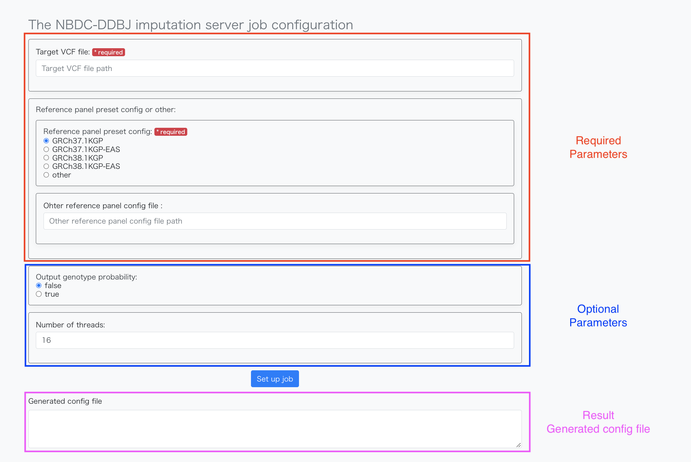

# imputationserver-web-ui

Web interface to generate parameters config file for imputation workflow.

## UI

Web site image is here

## Input

The web user interface enables the
 users to specify these parameters graphically.

### Mandatory parameters

2 input options is requried.

- 1. Target genotype dataset
  - VCF Format
- 2. Reference panel dataset
  - Dataset containing phased haplotypes

### Optional parameters

2 input options is optional.

- Number of threads (default value of 16) 
- The posterior probability of possible genotypes is included in the output file (default is false)

## Result

- Generated config file
  - This is used as input parameters for imputation workflow

## Workflow Available Imputation Algorithm.

| Program  | Version  |
|---|---|
| conform-gt  | 24May16  |
| Beagle 5.2  | 21Apr21.304  |
| bcftools  | 1.9  |

More workflow detail is [https://sc.ddbj.nig.ac.jp/advanced_guides/imputation_server](https://sc.ddbj.nig.ac.jp/advanced_guides/imputation_server)
